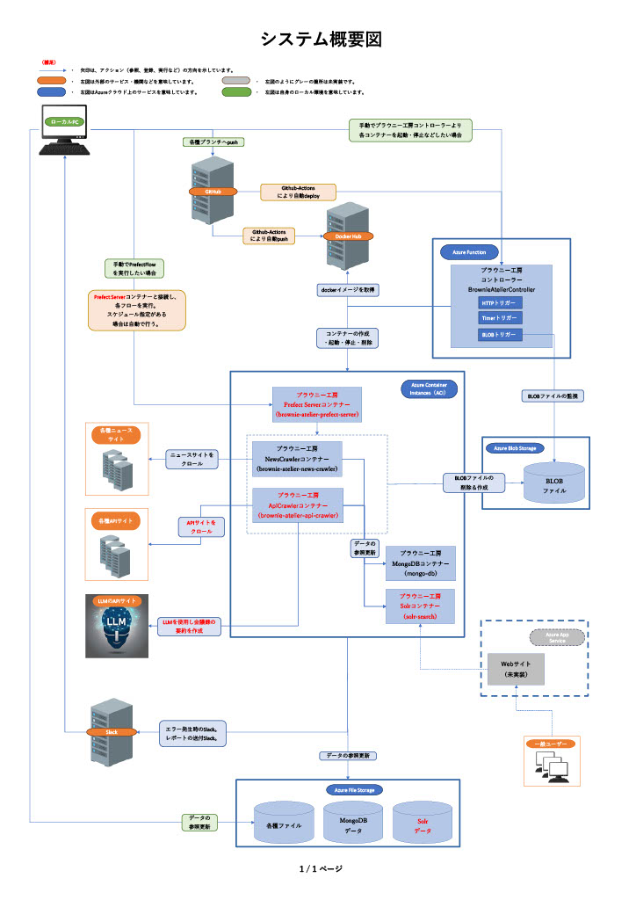

# Brawnie Atlier（ブラウニー工房）
## 目次
### Brawnie Atlier（ブラウニー工房）
  - [システム概要](#システム概要)
  - [当資料の基準日](#当資料の基準日)
  - [主要技術](#主要技術)
  - [システム概要図](#システム概要図)
  - [自動テスト＆デプロイ（Github-Actions）](#自動テスト＆デプロイ)
  - [定期観測の処理の流れ](#定期観測の処理の流れ)
    - [主要機能である定期観測(regular\_observation\_flow.py)の処理の流れを紹介](#主要機能である定期観測regular_observation_flowpyの処理の流れを紹介)
  - [プロジェクトで使用されるGitリポジトリ](#プロジェクトで使用されるgitリポジトリ)
  - [プロジェクトで作成/使用するdockerリポジトリ一覧](#プロジェクトで作成使用するdockerリポジトリ一覧)
  - [現在実装済みのFlowの一覧](#現在実装済みのflowの一覧)
    - [各種登録系](#各種登録系)
    - [ニュースクロール・スクレイピング系](#ニュースクロールと・スクレイピング系)
    - [MongoDB更新系](#mongodb更新系)
    - [レポート系](#レポート系)
    - [チェック系](#チェック系)
  - [MongoDBのコレクション](#mongodbのコレクション)
    - [Mongoコレクション一覧](#mongoコレクション一覧)
    - [Mongoコレクションの削除運用](#mongoコレクションの削除運用)

## システム概要
- 現在、以下のような機能の構築を目指して作成中です。
1. 各種ニュースサイトから情報を収集する。
2. ソーシャルメディアから情報を収集する。
3. 公共機関等が公開しているビックデータを収集する。
4. 収集した情報を全文検索システムに入力し、様々な検索を行えるWEBサービスを提供する。
5. 収集した情報をマイクロソフトのCopilotに分析させ、様々なレポートを生成させWEB上で参照できるサービスを提供する（構想中）。

## 当資料の基準日
2024/5/13時点の情報となります。

## 主要技術
1. 言語(python3.9～)
2. フレームワーク Prefect2 ([ https://orion-docs.prefect.io/2.10.9/ ](https://orion-docs.prefect.io/2.10.9/))   Scrapy ([ https://docs.scrapy.org/en/2.6/ ](https://docs.scrapy.org/en/2.6/))
3. DB MongoDB ([ https://www.mongodb.com/docs/v7.0/ ](https://www.mongodb.com/docs/v7.0/) ) Apache Solr ([ https://solr.apache.org/ ](https://solr.apache.org/))
4. Git, Github, Github-Actions
5. Docker, Docker Compose  ([ https://docs.docker.jp/ ](https://docs.docker.jp/))
6. Azure Container Instances (ACI)  ([ https://azure.microsoft.com/ja-jp/products/container-instances ](https://azure.microsoft.com/ja-jp/products/container-instances))
7. Azure Functions (Httpトリガー、Timerトリガー、BLOBトリガー)   ([ https://azure.microsoft.com/ja-jp/products/functions ](https://azure.microsoft.com/ja-jp/products/functions))
8. Azure File Storage, Azure BLOB Storage   ([ https://learn.microsoft.com/ja-jp/azure/storage/common/storage-introduction ](https://learn.microsoft.com/ja-jp/azure/storage/common/storage-introduction))

[目次へ戻る](#目次)

## システム概要図

[目次へ戻る](#目次)

<!-- ## Github-Actions_CICD概要 -->

## 自動テスト＆デプロイ
- Github-Actionsを使用。
- 自動デプロイ
  - アプリを格納したDockerイメージをbuildし、DockerHubへpusuする。
  - 自作したPrefect Flowを、Prefect社が提供しているPrefect Cloudへdeployする。
- 自動テスト
  - アプリを格納したDockerイメージをbuildし、Dockerコンテナーを起動し各Prefect Flowを実行する。

  

    
自動デプロイの概要

    
  

  

    
自動テストの概要

    
    

      <a href="static/(Github-Actions)自動テスト詳細.pdf" target="_blank">
        (Github-Actions)自動テスト詳細.pdf
      </a>
    

  

[目次へ戻る](#目次)

## 定期観測の処理の流れ
### 主要機能である定期観測(regular\_observation\_flow.py)の処理の流れを紹介

[目次へ戻る](#目次)

## プロジェクトで使用されるGitリポジトリ

| No. | リポジトリ名                                               | メイン | サブ  | 概要 | gitリポジトリー |
| :-- | :-------------------------------------------------------- | :----: | :--: | :--- | :------------ |
| 1   | BrownieAtelier ブラウニーアトリエ                        | 〇     |      | ブラウニー工房の主要ブランチ。 各種処理の実行には、フレームワーク：Prefect2のFlowを使用。 クローリングには、フレームワーク：Scrapyを使用。 スクレイピングには、上記フレームワークを使用せずbeautiful soupライブラリーを使用。 | https://github.com/pubranko/BrownieAtelier.git|
| 2   | BrownieAtelierController ブラウニーアトリエコントローラー | 〇     |      | AzureFunctionにより、ブラウニー工房を格納しているコンテナ、MongoDBコンテナの起動・停止を行う。| https://github.com/pubranko/BrownieAtelierController.git |
| 3   | BrownieAtelierMongo ブラウニーアトリエMongoDB            |        | 〇   | Gitサブモジュール。MongoDBコンテナへの接続、参照、更新を行う専用モジュール。 | https://github.com/pubranko/BrownieAtelierMongo.git      |
| 4   | BrownieAtelierNotice ブラウニーアトリエ通知              |        | 〇   | Gitサブモジュール。Slackまたはメールによる送信機能。エラー発生時の通知用モジュール。| https://github.com/pubranko/BrownieAtelierNotice.git     |
| 5   | BrownieAtelierStorage ブラウニーアトリエストレージ        |        | 〇   | Gitサブモジュール。AzureStoregeへの接続、参照、更新を行う専用モジュール。 | https://github.com/pubranko/BrownieAtelierStorage.git    |

[目次へ戻る](#目次)

## プロジェクトで作成/使用するdockerリポジトリ一覧
| No. | イメージ名                        | コンテナー名         | イメージリポジトリリンク                      | イメージリポジト補足説明                                |
| :-- | :------------------------------- | :------------------ | :------------------------------------------ | :---------------------------------------------------- |
| 1   | mikuras/brownie_atelier_app:0.15 | Brownie-atelier-app | https://hub.docker.com/repositories/mikuras | ブラウニー工房のアプリをUbuntu22.04へ格納したイメージ    |
| 2   | mongo:7.0.4-jammy                | mongo-azure-db      | https://hub.docker.com/_/mongo              | MongoDB公式イメージ                                   |

[目次へ戻る](#目次)

## 現在実装済みのFlowの一覧
### 各種登録系

| No.        | Flow一覧                                      | 処理概要|
| :--------- | :-------------------------------------------- | :------|
| Register-1 | regular_observation_controller_update_flow.py | 定期観測用のスパイダーを登録する。 定期観測に使用しないスパイダーはここでは登録しない。 登録先MongoDBコレクション(controller)。|
| Register-2 | scraper_info_uploader_flow.py                 | 各ニュースサイト別に、スクレイピングの情報を登録する。|
| Register-3 | stop_controller_update_flow.py                | 各ニュースサイト別に、定期観測クローリングのON/OFF、スクレイピングのON/OFF指定を登録する。|

### ニュースクロールと・スクレイピング系

| No.        | Flow一覧                                      | 処理概要|
| :--------- | :-------------------------------------------- | :------|
| Crawl-1    | first_observation_flow.py                     | 定期観測対象のスパイダーでまだ一度も定期観測していないスパイダーのみ実行する。|
| Crawl-2    | regular_observation_flow.py                   | 定期観測対象のスパイダーを実行する。 ※対象のスパイダーは、上述「Register-1」で登録する。|
| Crawl-3    | manual_crawling_flow.py                       | 手動でクローリングを行う際、必要な引数を与えて実行します。|
| Crawl-4    | manual_scrapying_flow.py                      | 手動でスクレイピングを行う際、必要な引数を与えて実行します。|
| Crawl-5    | manual_news_clip_master_save_flow.py          | 手動でニュースクリップマスターへ保存を行う際、必要な引数を与えて実行します。|

### MongoDB更新系

| No.        | Flow一覧                                      | 処理概要|
| :--------- | :-------------------------------------------- | :------|
| Mongo-1    | mongo_delete_selector_flow.py                 | mongodbの各種コレクションに対して、指定したデータを削除する。|
| Mongo-2    | mongo_export_selector_flow.py                 | mongodbの各種コレクションに対して、指定したデータをエクスポートする。|
| Mongo-3    | mongo_import_selector_flow.py                 | mongodbの各種コレクションに対して、指定したデータをインポートする。|

### レポート系

| No.        | Flow一覧                                      | 処理概要|
| :--------- | :-------------------------------------------- | :------|
| Report-1   | scraper_pattern_report_flow.py                | 各ニュースサイト別のスクレイピング結果より、使われたパターンの統計情報をExcelで作成しメールにて送信する。|
| Report-2   | stats_info_collect_flow.py                    | 各ニュースサイトをクローリングした際、フレームワーク：Scrapyでは統計情報を出力している。 その統計をMongoDBに保存させているため、情報を扱いやすいように加工したデータを日付別に保存する。|
| Report-3   | stats_analysis_report_flow.py                 | 各ニュースサイトをクローリングした際、フレームワーク：Scrapyでは統計情報を出力している。 その統計をMongoDBに保存させているため、それを使いレポートをExcelで作成しメールにて送信する。|

### チェック系

| No.        | Flow一覧                                      | 処理概要|
| :--------- | :-------------------------------------------- | :------|
| Check-1    | crawl_sync_check_flow.py                      | クロール対象となったURLとクローラーレスポンス（crawler_response）の同期が取れているかチェック。 クローラーレスポンス（crawler_response）とニュースクリップマスター（news_clip_master）の同期が取れているかチェック。 |

### 定期実行系
| No.        | Flow一覧                                 | 処理概要|
| :--------- | :--------------------------------------- | :------|
| 1          | morning_flow_net.py                      | 毎朝実行用のフローを繋げたフローネットを実行。|

[目次へ戻る](#目次)

## MongoDBのコレクション
### Mongoコレクション一覧

| №   | コレクション（※RDBのテーブルに相当）                         | レコードタイプ                                            | コレクションの用途                                                                         |
| :-- | :--------------------------------------------------------- | :------------------------------------------------------- | :--------------------------------------------------------------------------------------- |
| 1   | クローラーログ crawler_logs                              | スパイダーレポート spider_reports                       | クロール時、クロール対象となったURLやScrapyの統計情報を保存する。                             |
|     |                                                            | フローレポート flow_reports                             | PrefectFlowの実行ログを保存する。                                                         |
| 2   | クローラーレスポンス crawler_response                     | -                                                        | クロール結果を保存する。 ※レスポンスの結果をheaderとbodyに分けてそのまま保存している。     |
| 3   | レスポンスからのスクレイピング結果 scraped_from_response   | -                                                         | 上記クローラーレスポンスからスクレイピングした結果を保存する。                               |
| 4   | ニュースクリップマスター scraped_from_response            | -                                                         | 上記スクレイプ結果からニュースクリップマスターへ保存する。                                   |
| 5   | コントローラー controller                                | クロールポイント crawl_point                             | 定期観測において、次回のクロールポイントを保存する。                                        |
|     |                                                            | ストップコントローラー stop_controller                   | 定期観測のクローラー、スクレイピングを停止させたい場合に登録する。                            |	
|     |                                                            | 定期観測コントローラー regular_observation_controller    | 定期観測対象となるスパイダーを登録する。                                                   |	
| 6   | ドメイン別スクレイパー scraper_by_domain                  | -                                                         | 各ニュースサイト別のスクレイピング情報を登録する。                                          |
| 7   | 統計情報の収集 stats_info_collect                        | スパイダー統計 spider_stats                              | 上記クローラーログのScrapy統計情報よりデータを取得し保存する。                              |
|     |                                                            | ロボッツ統計 robots_response_status                     | 上記クローラーログのScrapy統計情報よりデータを取得し保存する。                               |
|     |                                                            | ダウンローダー統計 downloader_response_status            | 上記クローラーログのScrapy統計情報よりデータを取得し保存する。                              |
| 8   | 非同期レポート asynchronous_report                       | ニュースクロール非同期 news_crawl_async                   | クロール対象とクローラーレスポンスが非同期の情報を保存する。                                |
|     |                                                            | ニュースクリップマスター非同期 news_clip_master_async     | クローラーレスポンスとニュースクリップマスターが非同期の情報を保存する。                      |
|     |                                                            | ソーラーニュースクリップ非同期 solr_news_clip_async       | ニュースクリップマスターとソーラーニュースクリップが非同期の情報を保存する。                  |

[目次へ戻る](#目次)

### Mongoコレクションの削除運用

| №   | コレクション（※RDBのテーブルに相当）                         | データ 保存期間 | データメンテナンス運用  |
| :-- | :-------------------------------------------------------   | :-------------: | :----------------------- |
| 1   | クローラーログ crawler_logs                              | 1日            | 毎朝初回起動時に一括削除。 レスポンスからニュースクリップマスターへの保存する際の中間ワークであるため保存不要。 |
| 2   | クローラーレスポンス crawler_response                     | 1ヵ月          | 1ヵ月経過したデータをMongoエクスポート（mongo_export_selector_flow.py）にて抽出しAzure File Storageに保存する。 その後Mongo削除フロー（mongo_delete_selector_flow.py）にて削除する。 |
| 3   | レスポンスからのスクレイピング結果 scraped_from_response   | 1ヵ月          | 同上  |
| 4   | ニュースクリップマスター scraped_from_response            | 1ヵ月          | 同上  |
| 5   | ドメイン別スクレイパー scraper_by_domain                  | 1ヵ月          | 同上  |
| 6   | 非同期レポート asynchronous_report                       | 1ヵ月          | 同上 |
| 7   | 統計情報の収集 stats_info_collect                        | 1ヵ月          | 同上  |
| 8   | コントローラー controller                                | 永続           | 削除は行わない。 ただし毎朝初回起動時にMongoエクスポート（mongo_export_selector_flow.py）にてバックアップを行う。 |

[目次へ戻る](#目次)

